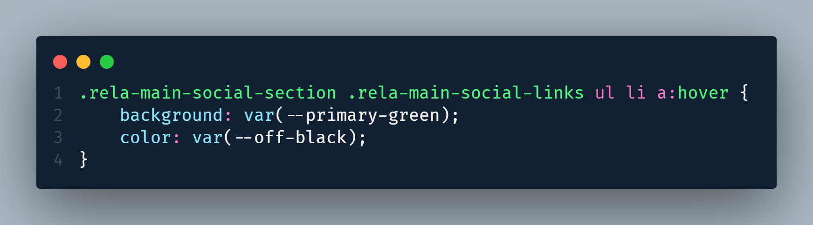

# Frontend Mentor - Social links profile solution

This is a solution to the [Social links profile challenge on Frontend Mentor](https://www.frontendmentor.io/challenges/social-links-profile-UG32l9m6dQ). 

## Table of contents

- [Overview](#overview)
  - [The challenge](#the-challenge)
  - [Screenshot](#screenshot)
  - [Links](#links)
- [My process](#my-process)
  - [Built with](#built-with)
  - [What I learned](#what-i-learned)
- [Author](#author)
- [Acknowledgments](#acknowledgments)


## Overview

### The challenge

Users should be able to:

- See hover and focus states for all interactive elements on the page

### Screenshot




### Links

- Solution URL: [GitHub Link](https://github.com/therobiulislam12/social-links-profile)
- Live Site URL: [Live site URL](https://therobiulislam12.github.io/social-links-profile/)

## My process

### Built with

- Semantic HTML5 markup
- CSS custom properties
- Flexbox
- Mobile-first workflow


### What I learned

The code structure is the best way to create good UI. I use semantics for my code, and it helps me understand which approach is the best for me. I used a common structure for CSS development, so I didn't face any problems.


```css
:root{
    --primary-green: hsl(75, 94%, 57%);
    --white: hsl(0, 0%, 100%);
    --grey: hsl(0, 0%, 20%);
    --dark-grey: hsl(0, 0%, 12%);
    --off-black: hsl(0, 0%, 8%);
}

/* Common CSS */
*, html{
    margin: 0;
    padding: 0;
    box-sizing: border-box;
}
body{
    font-family: "Inter", sans-serif;
    font-size: 14px;
    font-weight: 400;
    background-color: var(--off-black);
    height: 100vh;
    display: flex;
    justify-content: center;
    align-items: center;
    color: var(--white);
}

ul li{
    list-style: none;
}

a{
    text-decoration: none;
    color: var(--white);
}
```


## Author

- Website - [Robiul Islam](https://robiul-islam.netlify.app)
- Frontend Mentor - [@therobiulislam12](https://www.frontendmentor.io/profile/therobiulislam12)
- Twitter - [@therobiulislam12](https://www.twitter.com/therobiulislam12)

## Acknowledgments

Do more projects and practice all the time. It will be the best in your whole life.
